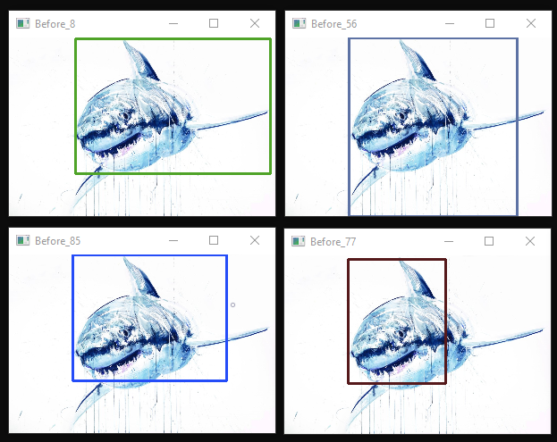
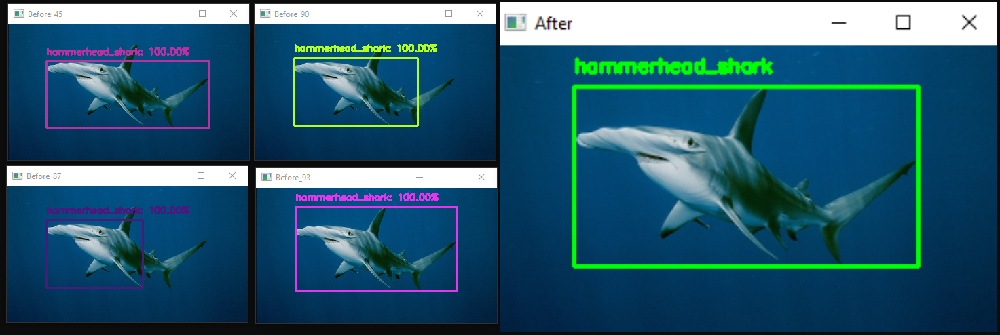
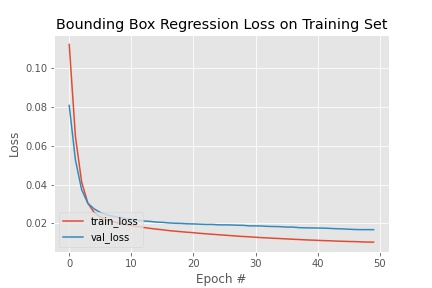
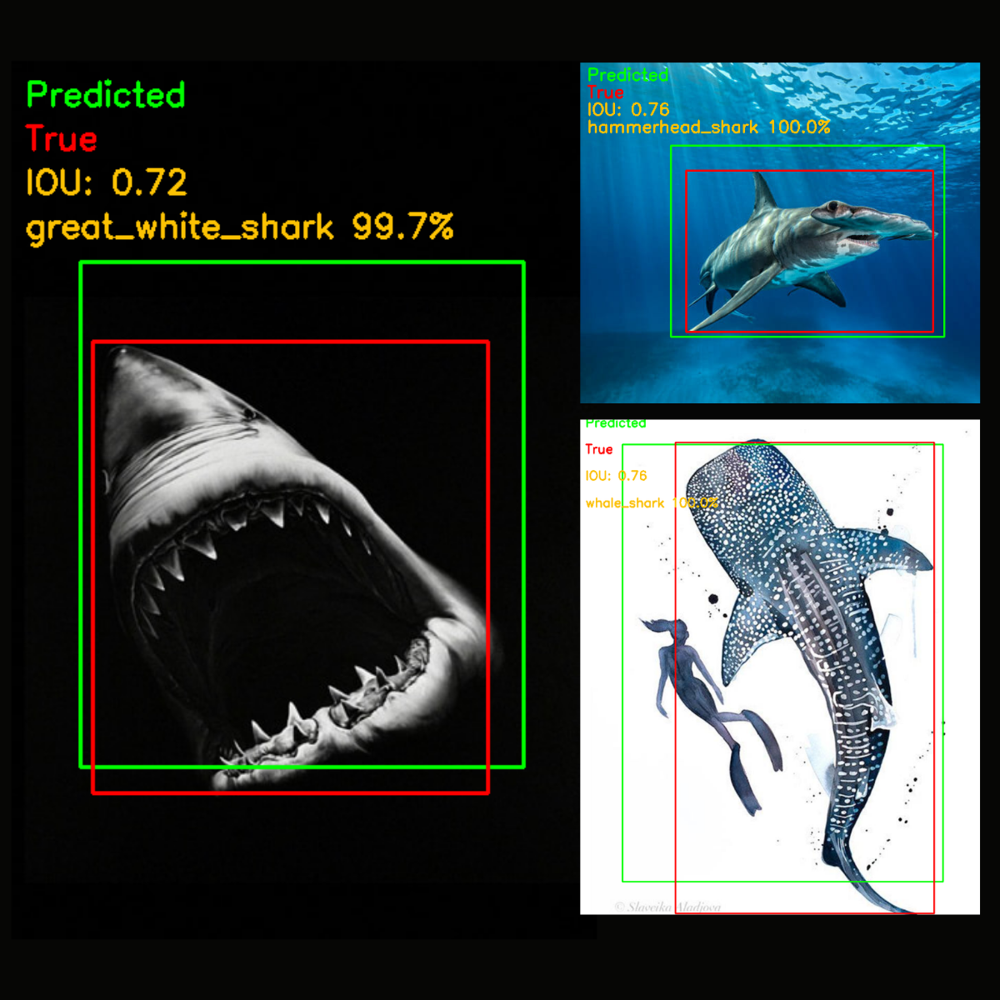

# sharknado2 🦈
## Shark Detection with Python, OpenCV and Keras

[]()
[]()
[]()

### Introduction

The first episode of sharknado was a classification model that was able to distinguish different shark species with an acceptable precision. The state of the art model was a finetuned VGG16 Convolutional network, trained on roughly 2000 images of different shark species with an out-ofthe-sample accuracy of 92%. 

The project can be found here:

[](https://github.com/gcgrossi/sharknado)

At this point, a natural continuation of this serie seem to be to extend the model to a shark detection. While a shark classification can only tell if an image contains a sharks and what kind of shark is (so basically classify the topic of the image), a shark detector can also locate the shark in the image and predict the coordinates of the rectangle surrounding the detected object (the bounding box).

So here is the second episode of this thrilling saga of sharks and computer vision with python: **sharknado2 - Shark Detection with Python, OpenCV and Keras**.

### Dataset

[](https://drive.google.com/drive/folders/19haNnXAuVGM1qFYq9Sa5Ktl7RLVgJDPI?usp=sharing)

The Dataset has been constructed using the Google Image Download Tool I introduced in [this article](https://gcgrossi.github.io/google-image-downloader/). I have collected about 950 images of white sharks and 750 images of hammerhead sharks and 500 images of whale sharks, as well as context images containing a "not shark" class. The reason for the latter will be clear when approching the detection problem later on.

The directory structure is organized in the following way:

```
./
└───sharks
    ├───great_white_shark
    ├───hammerhead_shark
    ├───mako
    ├───tiger_shark
    ├───whale_shark
    ├───not_shark
    └───shark_annotation.csv
```

The training phase will crawl the directories and assing a label to each image based on the folder name in which they are stored. The directory structure is therefore important to the project. You can find the dataset at the beginning of the section.

### Region Proposal Approach

This approach is covered in the ```shark_detection_selective_search.py``` script.

A very simple and straightforward way of extending a classificator to a detector is by implementing a Region Proposal methodology. The technique is very simple and follows these steps:

1. An algorithm proposes regions of interest of the input image.
2. Your classification model classifies those regions.
3. You retain only the regions with high classification confidence.
4. You run a final algorithm to merge the retained regions.

Let's see how we can implement it:

#### OpenCV Selective Search Alogorithm 
Number 1: we use an OpenCV built-in algorithm: Selective Search. Given an input image the algoritm proposes "interesting regions" based on some features:

- Color similarity
- Texture similarity
- Size similarity
- Shape compatibility

More information about the process can be found [in the OpenCV Official Site](https://learnopencv.com/selective-search-for-object-detection-cpp-python/). The algorithm proposes about 2000 regions per image, as shown in the figure below (with only a selection of some proposed regions):


Some of them are context regions, some others are very small or only partially overlap with the objects in the image. We will need a way to skim those regions to speed up the process. 

First of all, the regions proposed are sorted by the algorithm based of an "objectiveness" score, so that the most salient regions will be the first proposed. We can therefore decide to only process the fisrt _n_ rois, where _n_ now becomes an hyperparameter to be tuned based on the needs.

We can also decide to cut small regions. For this, we will select only regions that have an area greater than _x_% of the original image, where _x_ is again an hyperparameter to tune. 

Once we have the selected regions it's time to apply our model

#### Classification Model
Number 2,3: these steps are carried out by the classification model chosen. The classification models are discussed extensively in the [sharknado](https://github.com/gcgrossi/sharknado) project and can be found here:

[](https://drive.google.com/drive/folders/1U3eNxBYE__wC8WuOCTNcrJmrY4SCGnrh?usp=sharing)

the model chosen for the project is the ```vggnet_finetune_wnegative_iou02.model```. This model is able not only to classify sharks, but also to classify regions of "context" (i.e. water, sky etc.) as "not shark". This rejection becomes critical with this approach, since the Selective Search algorithm proposes regions not containing sharks or containg only vague portions of skin.

An example of what happens when not including a negative class is shown in the following picture:


The model classifies regions of context as shark with high confidence. Those false positives will therefore pass all the selection criteria, resulting in wrong detections.

On the contrary, when using the model with a negative class, the situation is the following:



with false positives drastically reduced. The regions with very high confidence are selected. There are still more than one and, at the end, we will need to come up with just one region. We therefore need an algorithm to merge all the selected rois.

#### Non Maxima Suppression

------ Description -------

Afetr the algorithm has been applied we finally have the only and one bounding box with prediction, as the one in the following picture:



This i sa good one picked on purpose, but there are some drawbacks in the method. Even with a selection of the first 100 rois from Selective Search the algorithm is still too slow with a CPU, and the detection process takes a lot of time for just one image. There is still a good amount of false positives, given that the classification has not a very high accuracy.

While for the latter we can deal with some false positive, the former is inacceptable. This is the reason with a more precise and efficient method has been chosen.

### Boundig Box Regression

One possible solution to improve the detector is to train a model that is capable of predicting the coordinates of the bounding box of the shark in the image. Once we have this, we can easily apply the classification model to the predicted roi.
In order to do so we will need two elements:

1. A .csv file with the image annotations: the image file name and the coordinates of the bounding box. This will be used to instruct a neural network on the position of the bounding box
2. A suitable architecture to be trained on the annotated images

#### Image annotations

In the Dataset Drive folder linked above the file ```shark_annotation.csv``` contains the filename, folder (label), x top-left coordinate, y top-left coordinate, x bottom-right coordinate, y bottom-right coordinate of the bounding box. The file has been constructed using the ```annotate_images.py``` script, using a methodology that involves the usage of Google Vision API and the [google-vision-wrapper](https://github.com/gcgrossi/google-vision-wrapper) python package. A detailed tutorial on how to use this file and the methodology can be found here:

[](https://gcgrossi.github.io/google-vision-wrapper/tutorials/shark_annotation_tutorial.html)

#### Architecture
Once the dataset has been prepared and annotated, it's time to train a model. The architecture chosen for the purpose is the same used for training the classification model: The VGG16 Convolutional Neural Network, pre-trained on the ImageNet dataset. From here the methodology is the same applied to the classification model, where the fully connected head of the network has been removed, the inner layers have been freezeed, and a new 4-neuron output layer (trainable) has been attached to the body of the architecture and trained on the annotated dataset. 

The resulting model is the following

```
_________________________________________________________________
Layer (type)                 Output Shape              Param #   
=================================================================
input_6 (InputLayer)         [(None, 224, 224, 3)]     0         
_________________________________________________________________
block1_conv1 (Conv2D)        (None, 224, 224, 64)      1792      
_________________________________________________________________
block1_conv2 (Conv2D)        (None, 224, 224, 64)      36928     
_________________________________________________________________
block1_pool (MaxPooling2D)   (None, 112, 112, 64)      0         
_________________________________________________________________
block2_conv1 (Conv2D)        (None, 112, 112, 128)     73856     
_________________________________________________________________
block2_conv2 (Conv2D)        (None, 112, 112, 128)     147584    
_________________________________________________________________
block2_pool (MaxPooling2D)   (None, 56, 56, 128)       0         
_________________________________________________________________
block3_conv1 (Conv2D)        (None, 56, 56, 256)       295168    
_________________________________________________________________
block3_conv2 (Conv2D)        (None, 56, 56, 256)       590080    
_________________________________________________________________
block3_conv3 (Conv2D)        (None, 56, 56, 256)       590080    
_________________________________________________________________
block3_pool (MaxPooling2D)   (None, 28, 28, 256)       0         
_________________________________________________________________
block4_conv1 (Conv2D)        (None, 28, 28, 512)       1180160   
_________________________________________________________________
block4_conv2 (Conv2D)        (None, 28, 28, 512)       2359808   
_________________________________________________________________
block4_conv3 (Conv2D)        (None, 28, 28, 512)       2359808   
_________________________________________________________________
block4_pool (MaxPooling2D)   (None, 14, 14, 512)       0         
_________________________________________________________________
block5_conv1 (Conv2D)        (None, 14, 14, 512)       2359808   
_________________________________________________________________
block5_conv2 (Conv2D)        (None, 14, 14, 512)       2359808   
_________________________________________________________________
block5_conv3 (Conv2D)        (None, 14, 14, 512)       2359808   
_________________________________________________________________
block5_pool (MaxPooling2D)   (None, 7, 7, 512)         0         
_________________________________________________________________
flatten_5 (Flatten)          (None, 25088)             0         
_________________________________________________________________
dense_20 (Dense)             (None, 128)               3211392   
_________________________________________________________________
dense_21 (Dense)             (None, 64)                8256      
_________________________________________________________________
dense_22 (Dense)             (None, 32)                2080      
_________________________________________________________________
dense_23 (Dense)             (None, 4)                 132       
=================================================================
Total params: 17,936,548
Trainable params: 3,221,860
Non-trainable params: 14,714,688
_________________________________________________________________
None
```
#### Training
The model has been trained using 1000 annotated images, with batch size of 32, initial learning rate of 1e-5, mean squared error loss and Adam optimizer. The model has been trained using Google Colab in ```vggnet_bbregression_train.ipynb```.

[](https://colab.research.google.com/drive/1h8iulak79Vb5ZmGa3w3K9TXFAoQs9qCx?usp=sharing)

After 50 epochs the model converges to a good solution, as shown in the figure below:



#### Evaluation
A mini test set of 60 images has been also dowloaded to understand the performance out-ofthe-sample. The images have been deliberately chosen to be tricky and deceiving for the network. The test dataset can be found here:

[](https://drive.google.com/drive/folders/1g3v30aG7L6DoBf6iUeJCMfis4G_Ez5aR?usp=sharing)

with the same folder structure of the training data:

```
./
└───test
    ├───great_white_shark
    ├───hammerhead_shark
    ├───whale_shark
    └───test_annotation.csv
```

And they have been annotated using the same method described for the training data. The annotations can be found in the file ```test_annotation.csv```

In order to evaluate the performace of the bounding box regression the metric has been chosen to measures the degree of overlap between the predicted bounding box and the true bounding box. The Intersection over Union (IoU) measures the ratio between the area of the intersection of the two regions and the area of their union. In this way, a high IoU represents a strong compatibility between the prediction and the truth. 

For the classification task, the accuracy metric has been chosen.

The average IoU and accuracy obtained on the test set are summarized below:

|       IoU        | Accuracy           |
| --- | --- |
|    74%   | 81%           | 

The figure below shows some of the results obtained on the dataset:



