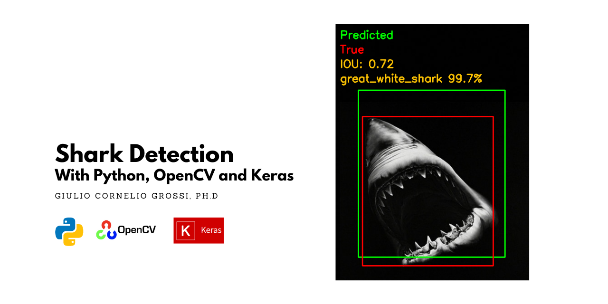
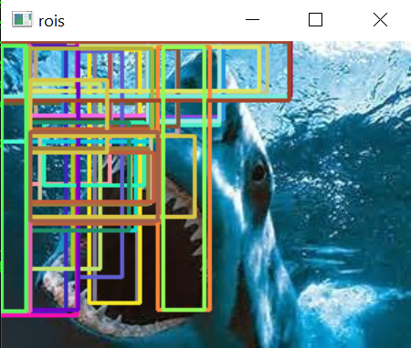
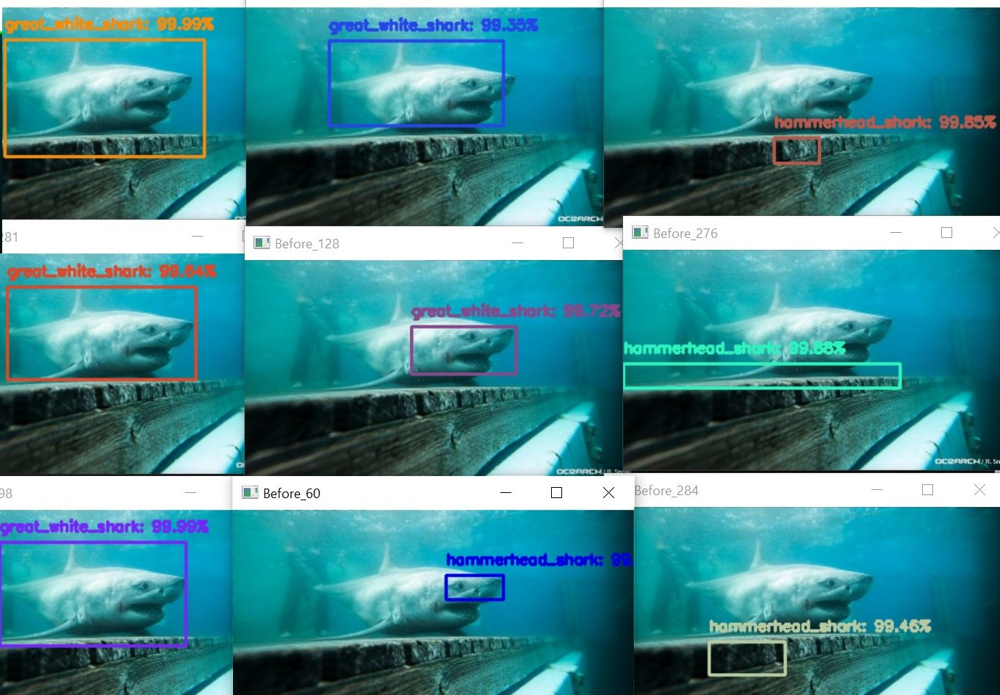

# sharknado2 🦈
## Shark Detection with Python, OpenCV and Keras

[]()
[]()
[]()

### Introduction

The first episode of sharknado was a classification model that was able to distinguish different shark species with an acceptable precision. The state of the art model was a finetuned VGG16 Convolutional network, trained on roughly 2000 images of different shark species with an out-ofthe-sample accuracy of 92%. 

The project can be found here:

[](https://github.com/gcgrossi/sharknado)

At this point, a natural continuation of this serie seem to be to extend the model to a shark detection. While a shark classification can only tell if an image contains a sharks and what kind of shark is (so basically classify the topic of the image), a shark detector can also locate the shark in the image and predict the coordinates of the rectangle surrounding the detected object (the bounding box).

So here is the second episode of this thrilling saga of sharks and computer vision with python: **sharknado2 - Shark Detection with Python, OpenCV and Keras**.

### Dataset

[](https://drive.google.com/drive/folders/19haNnXAuVGM1qFYq9Sa5Ktl7RLVgJDPI?usp=sharing)

The Dataset has been constructed using the Google Image Download Tool I introduced in [this article](https://gcgrossi.github.io/google-image-downloader/). I have collected about 950 images of white sharks and 750 images of hammerhead sharks and 500 images of whale sharks, as well as context images containing a "not shark" class. The reason for the latter will be clear when approching the detection problem later on.

The directory structure is organized in the following way:

```
./
└───sharks
    ├───great_white_shark
    ├───hammerhead_shark
    ├───mako
    ├───tiger_shark
    ├───whale_shark
    ├───not_shark
    └───shark_annotation.csv
```

The training phase will crawl the directories and assing a label to each image based on the folder name in which they are stored. The directory structure is therefore important to the project. You can find the dataset at the beginning of the section.

### Region Proposal Approach

This approach is covered in the ```shark_detection_selective_search.py``` script.

A very simple and straightforward way of extending a classificator to a detector is by implementing a Region Proposal methodology. The technique is very simple and follows these steps:

1. An algorithm proposes regions of interest of the input image.
2. Your classification model classifies those regions.
3. You retain only the regions with high classification confidence.
4. You run a final algorithm to merge the retained regions.

Let's see how we can implement it:

#### OpenCV Selective Search Alogorithm 
Number 1: we use an OpenCV built-in algorithm: Selective Search. Given an input image the algoritm proposes "interesting regions" based on some features:

- Color similarity
- Texture similarity
- Size similarity
- Shape compatibility

More information about the process can be found [in the OpenCV Official Site](https://learnopencv.com/selective-search-for-object-detection-cpp-python/). The algorithm proposes about 2000 regions per image, as shown in the figure below (with only a selection of some proposed regions):



Some of them are context regions, some others are very small or only partially overlap with the objects in the image. We will need a way to skim those regions to speed up the process. 

First of all, the regions proposed are sorted by the algorithm based of an "objectiveness" score, so that the most salient regions will be the first proposed. We can therefore decide to only process the fisrt _n_ rois, where _n_ now becomes an hyperparameter to be tuned based on the needs.

We can also decide to cut small regions. For this, we will select only regions that have an area greater than _x_% of the original image, where _x_ is again an hyperparameter to tune. 

Once we have the selected regions it's time to apply our model

#### Classification Model
Number 2,3: these steps are carried out by the classification model chosen. The classification models are discussed extensively in the [sharknado](https://github.com/gcgrossi/sharknado) project and can be found here:

[](https://drive.google.com/drive/folders/1U3eNxBYE__wC8WuOCTNcrJmrY4SCGnrh?usp=sharing)

the model chosen for the project is the ```vggnet_finetune_wnegative_iou02.model```. This model is able not only to classify sharks, but also to classify regions of "context" (i.e. water, sky etc.) as "not shark". This rejection becomes critical with this approach, since the Selective Search algorithm proposes regions not containing sharks or containg only vague portions of skin.



